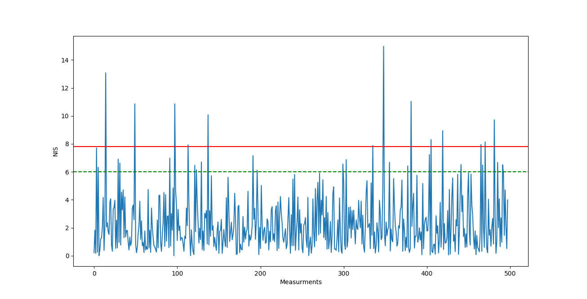

# Unscented Kalman Filter Project Starter Code
Self-Driving Car Engineer Nanodegree Program

---

## Dependencies

* cmake >= v3.5
* make >= v4.1
* gcc/g++ >= v5.4

## Basic Build Instructions

1. Clone this repo.
2. Make a build directory: `mkdir build && cd build`
3. Compile: `cmake .. && make`
4. Run it: `./UnscentedKF path/to/input.txt path/to/output.txt`. You can find
   some sample inputs in 'data/'.
    - eg. `./UnscentedKF ../data/obj_pose-laser-radar-synthetic-input.txt`
## Final result
### RMSE Laser & Radar sensor measurements fused
    0.0635598
    0.0834869
    0.330061
    0.212334
    
### RMSE Radar only
    0.150748
    0.201778
    0.35715
    0.313137

### RMSE Laser only
    0.101962
    0.0969141
    0.605049
    0.241758
    
### Normalized Innovation Squared (NIS) Plot

